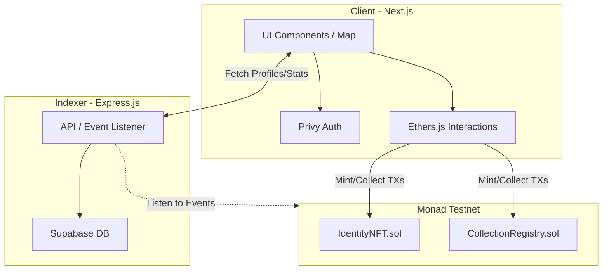

# 🌐 OmniMesh 

[](https://omnimesh.onrender.com)
[](https://monad.xyz)

> **Connect, Discover & Collect People**  
> OmniMesh uses ambient networking: turn it on only when you are socially available, discover nearby builders in a soft radar, wave, confirm meeting, then mint proof instantly on Monad.

---

## 🎯 About The Project

OmniMesh is a decentralized platform built on the Monad network that gamifies networking. By opting into an "intent-first networking mode", users can discover nearby professionals, confirm real-world meetings, and instantly mint "Proof of Meet" identities on-chain. 

### ✨ Key Features
- **⚡ Instant Finality**: Powered by the Monad blockchain for lightning-fast on-chain operations.
- **🗺️ Proximity Radar**: A dynamic, map-based interface using soft avatar positions to protect exact locations while enabling discovery.
- **🤝 Intent-First Networking**: Turn on your radar for a set session (e.g., 45 minutes) when you are open to meeting others.
- **👋 Wave & Collect**: Wave at nearby users, confirm your meeting, and collect their Identity NFT.
- **🧠 Seamless Onboarding**: Silent wallet creation powered by Privy. No seed phrases needed!

---

## 🏛 Architecture

OmniMesh is built with a modern, full-stack Web3 architecture, utilizing Next.js for the frontend, a custom Node.js indexer, and Solidity smart contracts on the Monad testnet.



### 🛠 Tech Stack
- **Frontend**: Next.js 16, React, TailwindCSS, React-Leaflet
- **Backend**: Express.js, Supabase, Node.js
- **Blockchain**: Solidity, Hardhat, Ethers.js, Monad Testnet
- **Web3 Integration**: Privy (Wallet Abstraction), Pinata (IPFS)

---

## 👥 Team MAHA-LAKSHMI

We are a team of passionate developers building the future of decentralized social networking.

| Role | Name |
| :--- | :--- |
| **Team Leader** | Ritik Soni |
| **Team Member** | Arpit Bhardwaj |
| **Team Member** | Om Gupta |
| **Team Member** | Himanshu Kumar |

---

## 🚀 Getting Started Locally

### Prerequisites
- Node.js (v18+)
- npm, yarn, or pnpm
- A Supabase account (optional, for indexer)
- Monad Testnet RPC & deployed contract addresses

### Installation

1. **Clone the repository:**
   ```bash
   git clone <your-repo-url>
   cd Proof-Go
   ```

2. **Install dependencies:**
   ```bash
   npm install
   ```

3. **Set up environment variables:**
   Create a `.env.local` file in the root directory and add your keys (Privy, Supabase, Contract Addresses, RPC URL).

4. **Run the development environment:**
   This command starts both the Next.js frontend and the Node.js backend indexer concurrently.
   ```bash
   npm run dev
   ```

5. **Open your browser:**
   Navigate to [http://localhost:3000](http://localhost:3000)

---
*Built for the next generation of on-chain social interactions.*
